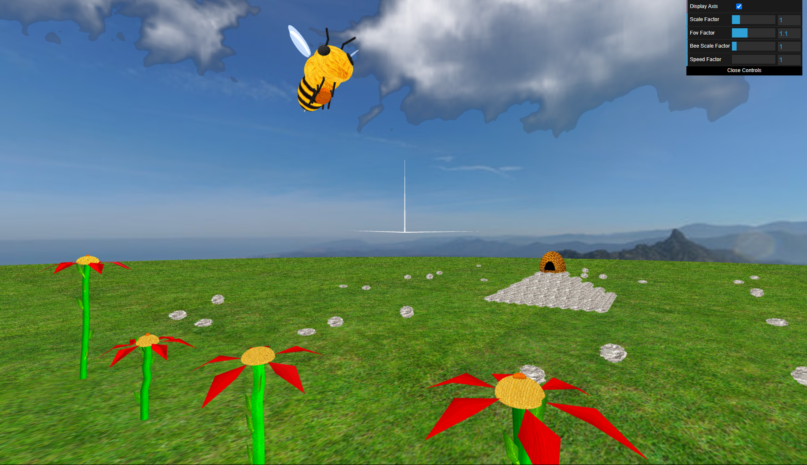
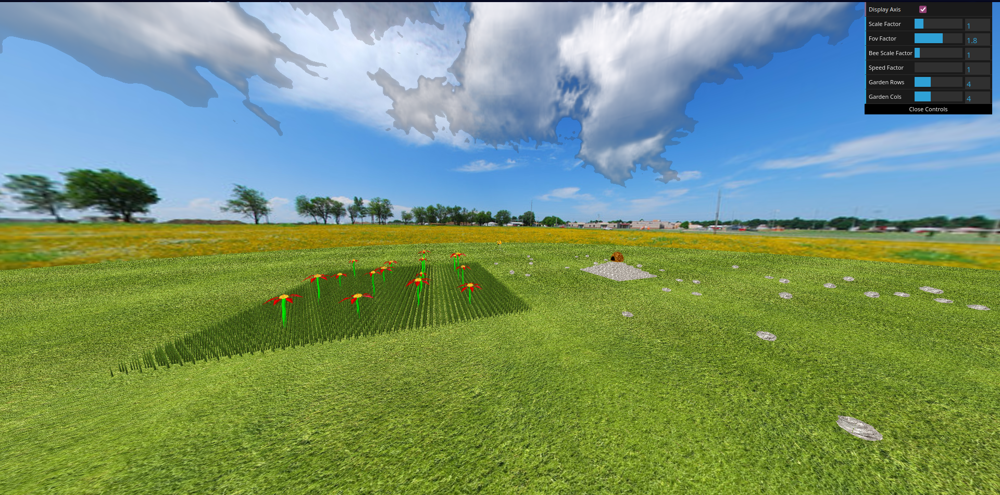

# Project T07G07
- **Francisco Cardoso**: up202108793
- **António Azevedo**: up202108689

## How to run
Run an http server in the `project/` directory

## Controls

### Basic Movement
 - `W` to accelerate
 - `S` to brake
 - `A` to turn left
 - `D` to turn right

### Special movement
 - `F` to manually descend at an incline, keeping the bee's X and Z speed
 - `B` to automatically descend to the nearest flower
 - `P` to rise back to normal height, picking up a pollen grain if possible
 - `O` to automatically drop the pollen grain off at the hive

---
## Implementation

### Sky-Sphere

A sky-sphere is a sphere rendered from the inside, simulating the view of the terrain up to the horizon and the sky above.

#### Creating a sphere

In order to create a sky-sphere we first need to create a sphere. For that we have implemented the class `Mysphere`, this class implements a sphere using polar coordinates.

##### Functionality

The MySphere class offers the following functionalities:

-   Creates a sphere centered at the origin, with its central axis aligned with the Y-axis and a unit radius.
-   Allows customization of the number of "slices" around the Y-axis and "stacks" from the equator to the poles, providing a detailed control over the sphere's smoothness.
-   Employs an efficient algorithm to generate vertices, normals, and texture coordinates for the sphere's surface.
-   Handles the creation of triangles for the sphere's top and bottom caps, ensuring proper rendering.
-   Supports the option to create a semi-sphere or a full sphere.
-   Allows rendering the sphere from the inside (sky view) or outside (regular view) by inverting normals.

##### Usage

```js
import { MySphere } from './MySphere.js';
const sphere = new MySphere(scene, stacks, slices, isSemiSphere?, isInverted?);
sphere.display();
```

#### Adding panoramas

Having the `MySphere` class we now need to create  a class to simulate the panorama effect for that we create the class `MyPanorama`.

##### Constructor:

- Takes a CGFtexture object representing the panoramic image (equirectangular format) as input.
- Internally creates an inverted MySphere object with a high number of slices and stacks for a smooth appearance.
- Sets the material of the sphere to have only an emissive component, suitable for displaying the panorama effectively.

##### Display

- Applies a translation to position the sphere at the camera's location, creating the illusion of being surrounded by the panorama.
- Scales the sphere to a large radius (e.g., 200 units) to encompass the scene.
- Display MySphere object to render the panorama.


#### FOV

In this part we also added a Slider in the GUI to change the FOV of the camara.

Low POV


High POV


---
### Flowers

#### Modelling a flower

This section involves creating a flower composed of different objects. To start, the petals are composed of two triangles with the bases facing eachother, the receptacle is made of two spheres, the bottom flatter then the top one, and the stem composed of a cylinder that connects to the center point of the receptacle.

#### Parameterizing the flower

The MyFlower object is now parameterized with values to control the various aspects of the flower:
- Outer Radius: The radius of the circle that circumscribes the flower's petals.
- Number of Petals: The number of petals the flower has.
- Petal Color: The color of the flower's petals.
- Receptacle Radius: The radius of the circle or sphere representing the flower's receptacle (heart).
- Receptacle Color: The color of the flower's receptacle.
- Stem Radius: The radius of the cylinder representing the flower's stem.
- Stem Height: The number of cylinders that make up the stem's height.
- Stem Color: The color of the flower's stem.
- Leaf Color: The color of the flower's leaves.

Along side that, the petals are now curved down to an angle parameter of the MyPetal constructor, as well as the angle that the petals connect to the receptacle is now a parameter in the MyReceptacle contructor.

For the stem, it is now comprised of several small cylinders, randomly disaligned, with a MyLeaf object in each connecting point of two cylinders.

#### Randomness and diversity in the flower

The MyFlower constructor now uses the Math.random() function to introduce randomness in various parameters, creating unique flowers with each instantiation.

The MyGarden class is introduced to manage the placement and display of multiple flowers in a virtual garden, taking in it's constructor the number of columns and rows of the resulting 2D array of flowers. The `display()` function takes an argument `spacing` that determines the ammount of space in-between each flower.  

#### Textures on the flowers

To finish, we colected a total of 8 textures that randomly get selected among eachother when a new MyFlower object is instantiated, all mapped correctly to make the flower "look and feel" more realistic.

#### Usage 
```js
import { MyFlower } from "./MyFlower.js";
const myFlower = new MyFlower(scene,outer_radius,inner_radius,n_petals,stem_radius,stem_height,stem_stacks,stem_color,petal_color,petal_angle_min,petal_angle_max,petal_textures,receptacle_textures,stem_textures,leaf_textures, pollen_texture);
myFlower.display();
```
- `outer_radius`: (number) The radius of the circle that circumscribes the flower's petals.
- `inner_radius`: (number) The radius of the circle or sphere representing the flower's receptacle (heart).
- `n_petals`: (number) The number of petals the flower will have.
- `stem_radius`: (number) The radius of the cylinder representing the flower's stem.
- `stem_height`: (number) The total height of the flower stem (sum of all stem cylinder heights).
- `stem_stacks`: (number) The number of segments or "stacks" used to create the height of each stem cylinder.
- `stem_color`: (array of 4 numbers) RGBA color values for the flower's stem (e.g., [0.2, 0.5, 0.1, 1.0] for green).
- `petal_color`: (array of 4 numbers) RGBA color values for the flower's petals (e.g., [1.0, 0.0, 0.0, 1.0] for red).
- `petal_angle_min`: (number) Minimum angle (in radians) for the random variation in petal-receptacle attachment angles.
- `petal_angle_max`: (number) Maximum angle (in radians) for the random variation in petal-receptacle attachment angles.
- `petal_textures`: (array of textures) An array of texture objects to be applied to the flower's petals.
- `receptacle_textures`: (array of textures) An array of texture objects to be applied to the flower's receptacle.
- `stem_textures`: (array of textures) An array of texture objects to be applied to the flower's stem. 
- `leaf_textures`: (array of textures) An array of texture objects to be applied to the flower's leaves.
- `pollen_texture`: (texture) A texture object to be applied to the flower's pollen. 


---
### Rocks and Boulders

This section involves creating a collection of stones  of various sizes. These stones are generated using a MyRock class, which modifies vertices to create random and natural-looking protrusions and indentations. Additionally, a MyRockSet class arranges multiple rocks randomly into a grid, and a MyRockPiramid class stacks rocks in a pyramid shape.

#### MyRock

Similar to the `MySphere` we use polar coordinates to create a sphere however this time we add a random offset to each vertice in order to make ir robust, we also make so it is flatter than a sphere.

##### Usage

```js
import { MyRock } from './rock/MyRock.js';
const rock = new MyRock(scene, texture, flatness?);
rock.display();
```
- `texture` - Texture of the rock
- `flatness` - How flat you want your rock to be.


#### MyRockSet

The `MyRockSet` displays a random number of rocks into a grid of varying size.

##### Usage

```js
import { MyRockSet } from './rock/MyRockSet.js';
const rockset = new MyRockSet(scene,texture,bl,tr,nrocks,rocks_size);
rockset.display();
```
- `texture` - Texture of the rock
- `bl` - Array of size two with the bottom-left position of the grid
- `tr` - Array of size two with the top-right position of the grid
- `nrocks` - Number of rocks to display (If more than the rocks that fit in the grid then nrocks is the max number of rock that fit in the grid)
- `rock_size` - The size of the rock


#### MyRockPiramid

The `MyRockSet` displays a pyramid of rocks.

##### Usage

```js
import { MyRockPiramid } from './rock/MyRockPiramid.js';
const rockPyramid = new MyRockPyramid(scene,stacks,texture,bl, rocks_size?);
rockPyramid.display();
```
- `stacks` - Number of stacks of the pyramid
- `texture` - Texture of the rock
- `bl` - Array of size two with the bottom-left position of the pyramid
- `rock_size` - The size of the rock


---
### Bee

In this part of the project, we add an animated bee to the scene, controlled by the user's input and with realistic flight animations, including oscillation and wing flapping. For this, we created the `MyBee` class.

#### Modeling the Bee

The bee's design includes simplified body parts: a head, abdomen, thorax, wings, legs, sting, eyes, and antennas. Each part is created individually using spheres, cones, and cylinders, and then assembled to create the bee.

This is how we model each part:
- **Head**, **Thorax**, **Abdomen**, **Eye**: We create spheres and then flatten and stretch them until they form the perfect shape.
- **Sting**: We use a cone.
- **Legs**, **Antennas**: We use two cylinders, one large and one small, rotate and unite them with two small spheres.
- **Wings**: We create two spheres, flatten them until they are thin as paper sheets, then stretch and join them together.

After this, we properly rotate each part and join them together. We apply the correct textures to each part and make the wings transparent.


#### Animating the Bee

In this part, we create the animation for the `MyBee` class.

The bee is placed in the scene about 3 units above the ground. It has two constant animations simulating flight:

- An oscillation animation that makes the bee move slightly up and down, with each complete oscillation taking about 1 second.
- A wing flapping animation, where the wings rotate around the point where they join the body.

To achieve this, we first created an `update` function in the `MyBee` class, which receives the time since the app started to calculate and update the bee's y-position and its wings' angles.

Then, in our `MyScene` class, we created an `update` function that runs every 50 ms. This function calculates the time since the app started and then updates the bee by calling the bee's `update` function.

#### Controlling the Bee

In this part, we create the control system for the `MyBee` class.

To achieve this, we added the following code to the `MyInterface` class to handle multiple key presses simultaneously:

```javascript
initKeys() {
    // Create reference from the scene to the GUI
    this.scene.gui = this;

    // Disable the processKeyboard function
    this.processKeyboard = function () { };

    // Create a named array to store which keys are being pressed
    this.activeKeys = {};
}

processKeyDown(event) {
    // Called when a key is pressed down
    // Mark it as active in the array
    this.activeKeys[event.code] = true;
}

processKeyUp(event) {
    // Called when a key is released, mark it as inactive in the array
    this.activeKeys[event.code] = false;
}

isKeyPressed(keyCode) {
    // Returns true if a key is marked as pressed, false otherwise
    return this.activeKeys[keyCode] || false;
}
```

We then created a function in the `MyScene` class to process the keys pressed, calling two different functions of the `MyBee` class depending on the input given:

- `accelerate(v)`: Adds or reduces velocity to the bee.
- `turn(v)`: Changes the direction of the bee.

We also created a new function that calculates and updates the position of the bee based on its direction and velocity.

**Notes**: The velocity is calculated in the x and z directions. We added a maximum and minimum velocity for the bee (the minimum velocity only applies when the bee is moving).

##### GUI Sliders

- Speed Factor Slider: Adjusts the sensitivity of acceleration and rotation.
- Scale Factor Slider: Allows scaling of the bee for better observation of animations.

#### Usage

```js
import { MyBee } from './bee/MyBee.js';
const bee = new MyBee(scene,textures,pollen_coords,hive_coords);
bee.display();
```
- `textures` - Array with textures for the bee ( [beeHead,beeBody, beeEye, beeAntenna, beeWing])
- `pollen_coords` - Array with the coordinates of the pollen, both on the scene and in the `MyGarden` object (points to the flower holding the pollen grain)
- `hive_coords` - Array of size two with the cords of the hive


---
### Pollen and Hive

We created a `MyPollen` class, with an elongated shape and a rough orange texture repre
This new object is now in the center of each receptacle of each flower, with an applied random rotation around the Y axis.

Afterwards, we created the `MyHive` object comprised of two `MySphere` objects to form the main shape, each initialized as a semi sphere, and a third `MySphere` object with a pitch-black appearance to represent a hole in which the bee would enter.
We chose to go with the natural beehive look, rather than the man-made boxes.

After adding the pollen, we added some new functionalities to the bee:

- By pressing `F`, the bee will start descending until either:
    - Coliding with a flower, in which the bee will stop at the center of the flower.
    - Hitting the ground (or a minimum height), in which the bee will stop.

- By then pre
sing `P`, the bee will pick-up the pollen and start ascending back to it's normal height.

- Finally, by pressing `O` the bee will move to the beehive carrying the pollen, in which it will drop the pollen grain it's holding into the hive, later ascending to it's normal height once again. The bee´s movement path is determined using linear interpolation.

- Aditionally, we added a key bind to the `B` key, which will use the linear interpolation function to calc
late and follow the trajectory to the closest flower to the bee.

```js
import { MyPollen } from "./objects/MyPollen.js";
const pollen = new MyPollen(scene, texture);
pollen.display();
```
- `texture` - Texture for the pollen.

```js
import { MyHive } from "./objects/MyHive.js";
const hive = new MyHive(scene);
hive.display();
```


---


### Shaders and Animation

In this section, our goal is to bring life to the scenery by creating a vibrant and realistic grassy environment within a 50x50 flower bed. The focus lies on simulating the gentle movement of grass to mimic the effect of wind.

#### Shaping the Grass

We kickstart the process by sculpting the grass into small triangular strips, essentially laying the groundwork for the grass blades. To infuse a touch of natural variation and curvature into the grass, we introduce randomness into our calculations. This randomness factor, derived from a random number between 1 and 3, acts as an exponential multiplier in our curvature calculation.

Moreover, to inject further realism into our grassy landscape, we introduce variability in the orientation of the grass blades. By randomly selecting an angle between π/4 and π/8 radians, we determine the directional orientation of the grass blades, enhancing the overall authenticity of the scenery.

Following this, we implement `MyGrassGarden`, a component that seamlessly displays the 50x50 flower bed adorned with lush grass.

#### Waving the Grass

To achieve the graceful movement of grass, we delve into the realm of shaders. We craft a shader capable of dynamically altering the curvature of the grass over time. Leveraging the `sin(time)` function, the shader adapts the curvature of the grass, creating an illusion of gentle swaying in response to the passage of time.

This shader is then seamlessly integrated into `MyScene`, enabling the grass to dance harmoniously with the ambient wind. 

```js
import { GrassGarden } from "./objects/garden/GrassGarden.js";
const grassGarden = new GrassGarden(scene, x, y, texture, density);
grassGarden.display();
```
- `x` the X coordinate for the bottom-left of the garden
- `y` the Y coordinate for the bottom-left of the garden
- `texture` the texture of each brass blade
- `density` the density of the grass garden (maximum of 5)


---
### Additional developments - Clouds

In this section, we opted to implement the second option, focusing on the development of cloud animation.

Our goal is to enrich the realism of the sky by introducing dynamic cloud movement to the Sky-Sphere. To achieve this, we integrate a secondary texture containing cloud imagery, which overlays the existing sky texture.

To realize this effect, we start by obtaining a cloud texture with an alpha channel, allowing for transparency. This texture is then bound to a custom shader, specifically designed for cloud animation.

The shader receives the time since the app started and does two things:

- `Mixes the two textures` - the shader will mix the color of the two textures, using more of the clouds texture the whiter it is.

- `Move the clouds horizontally` - the shader will slowly move the clouds horizonatlly also giving it an effect of wind.


---

### Final project



