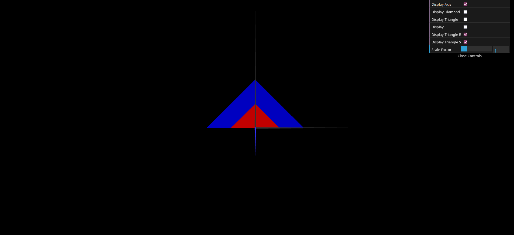

# CG 2023/2024

## Group T07G07

## TP 1 Notes

<<<<<<< Updated upstream
We began by analyzing the code and understanding how the library worked, as well as how to create objects using only triangles.

- For Exercise 1.1, we created the file "MyTriangle.js" following the structure provided in the given "MyDiamond.js" file to define the MyTriangle class. We then set the vertices as (-1,-1,0), (1,-1,0), and (-1,1,0) to form the intended triangle shape. The indices were defined in a counter-clockwise order to ensure proper coloring on the correct side.

- In Exercise 1.2, we emulated the diamond example by defining a variable displayTriangle in MyScene.js to control the visibility of the triangle. In that same file, we used an if statement, checking the value of that variable, in order to toggle the triangle's visibility by encapsulating the display() function in it. Finally, we added a checkbox element in the GUI in MyInterface.js, targeting the boolean variable created.

- For Exercise 1.3, we decomposed the parallelogram into triangles, resulting in two triangles: one with vertices (0,0,0),(2,0,0),(1,1,0) and another with vertices (1,1,0),(2,0,0),(3,1,0). Following the same process as in Exercise 1.1, we defined the four vertices and the corresponding indices for each triangle, ensuring they were ordered correctly to achieve the desired final result. To enable double-sided visibility, we duplicated the indices for each triangle and arranged them in a clockwise order, thereby making them double-sided.

- In Exercise 1.4, we replicated the approach from Exercise 1.2, this time with a variable named displayParallelogram.
<br>
- For Exercise 2, leveraging our understanding from Exercise 1, we created two classes: MyTriangleSmall and MyTriangleBig. These classes represent two double-sided triangles, with the small triangle having vertices (-1,0,0),(0,1,0),(1,0,0) and the large triangle having vertices (-2,0,0),(0,2,0),(2,0,0).

=======
We started by analysing the code and understanding how the library worked, as well as how we could create objects using only triangles.
- For exercise 1.1, we created the file "MyTriangle.js" and we followed the structure from the given "MyDiamond.js" file to create the MyTriangle class. We then defined the vertices as (-1,-1,0), (1,-1,0), and (-1,1,0), to create the intended triangle shape, defining the indices by the order that we typed so that it would be counter-clockwise, to appear collored on the correct side.
- For exercise 1.2, we followed the diamond example and, in MyScene.js, we defined a variable ```displayTriangle```, in order to control the value of the checkbox, and in the display function we used an if statement with this variable to toggle it's display. Finally, we added a checkbox element in the GUI in MyInterface.js, targetting the boolean variable created.
- For exercise 1.3, we started by decomposing the parallelogram into triangles, having arrived at two of them, one being (0,0,0),(2,0,0),(1,1,0) and the other being (1,1,0),(2,0,0),(3,1,0). Following the same process as we did for exercise 1.1, we defined the four vertices and we defined the indices for each in the order we typed them in for both triangles, giving us the desired final result. To acheive double-sided visibility, we added the same two groups of indices corresponding to each of the triangles we defined, and added them in the clockwise order, making it double-sided.
- For exercise 1.4, we repeated the same process of exercise 1.2, but this wime with a variable named ```displayParallelogram```.

- For exercise 2, we used what we learned in exercise 1, and we created two classes ```MyTriangleSmall``` and ```MyTriangleBig```, to create two double-sided triangles, the small one with vertices (-1,0,0),(0,1,0),(1,0,0) and the big one with (-2,0,0),(0,2,0),(2,0,0).

>>>>>>> Stashed changes

